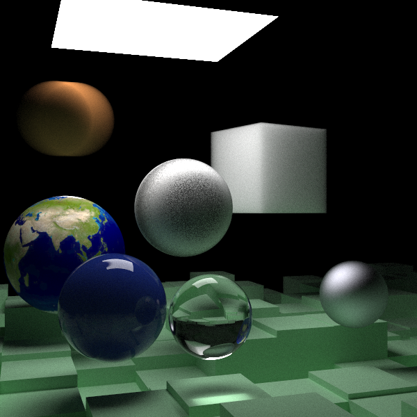

# Ray-Tracing-In-One-Weekend
This code follows the ray tracing in one weekend series.

After compiling, run the following command to produce a .ppm file:
[relative directory]\Ray-Tracing-In-One-Weekend.exe | set-content image.ppm -encoding utf8

On certain devices, the default character encoding can cause errors with ppm viewers, so
utf-8 was chosen as it works well with my ppm viewer of choice.

----------------------------------------------------------------------------------------------

The following image was created as a part of 'The Next Week' book:

I decided to substitute the normal box of spheres with a box of dense fog, as well as, omit
the fog which surrounded everything.
